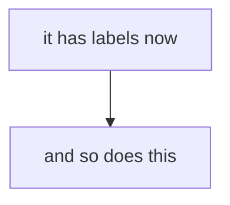

# mdnav

`mdcat`, with links you can click.

[mdcat](https://github.com/BIRSAx2/mdcat) renders Markdown in the terminal
beautifully, images included. What it cannot do is let you *follow* a link to
another local file: activating one hands it to your desktop, which opens it in
some other application, in some other window.

mdnav keeps you where you are. It is a pager — opens at the top of the
document, scrolls both ways, images and all — and a click on a link to another
Markdown file renders that file in the same pane, with a back stack.

```
mdnav README.md
```

```
up/down, k/j           scroll a line
wheel                  scroll 3 lines (MDNAV_WHEEL_LINES)
space/PgDn, b/u/PgUp   scroll a page
g / G                  top / bottom
click                  follow a link (ctrl+click hands it to the desktop)
/ ?                    search forward, backward
n / N                  next match, previous
esc                    clear the search
l                      list links with their targets, pick one by number
p, backspace           back to the previous file (:p too)
r                      reload now
Ng                     go to line N (as 50g)
:q, q                  quit
```

Resting the pointer on a link shows where it goes, in place of the usual
status line.

It re-renders on its own when the file changes on disk, so it can be left open
beside an editor; your place in the document is kept. `MDNAV_WATCH=0` turns
that off.

Long lines are left whole and wrapped by the terminal. mdcat wraps prose to the
width it is given but never code, since reflowing a code block would
misrepresent it, so code arrives wider than the window — and a line the
terminal wrapped is still one line to it, so selecting one copies it back
unbroken. Breaking them here instead would put real newlines into the middle
of the code. `-S` tells the terminal not to wrap, leaving long lines running
off the edge, as less's `-S` does.

`mdnav -c` renders once to stdout and exits, like mdcat. Links stay as plain
paths there, since nothing is running to receive a click. Piped rather than
shown on a terminal, mdcat cannot draw hyperlinks at all and numbers them
instead, listing the targets at the end — that list is longer here than under
mdcat alone because included files, HTML anchors and `{{#ref}}` directives all
become links that mdcat would otherwise not have seen. `-g` and `-G` control
search highlighting, as they do in less.

## Install

### First, mdcat

```
brew install mdcat          # macOS
pacman -S mdcat             # Arch
cargo install mdcat         # anywhere with a Rust toolchain
```

Prebuilt binaries are on [mdcat's releases
page](https://github.com/BIRSAx2/mdcat/releases). It is not packaged for Debian
or Ubuntu.

Building with `cargo` on Debian/Ubuntu needs the OpenSSL headers first,
otherwise the build fails partway through on `openssl-sys`:

```
sudo apt install pkg-config libssl-dev
```

### Then mdnav

```
git clone https://github.com/Ginger-Beard/mdnav
cd mdnav
./install.sh
```

### What it needs

| | |
|---|---|
| `mdcat` | does the rendering; see above |
| `python3` | rewriting links, slicing images, searching. Standard library only |
| bash 3.2+ | so stock macOS bash is enough |
| `stty`, `tput` | terminal size and raw input; coreutils and ncurses |
| ImageMagick (`convert`) | **strongly wanted**: without it images are not sliced, and a tall one jumps into view rather than scrolling. See [Images are sliced](#images-are-sliced) |
| `xdg-open`, `wslview`, or `open` | only for links to files that are not Markdown, which are handed to the desktop |

Most of that is already on a working system; `python3`, `stty` and `tput`
effectively always are. ImageMagick usually is not:

```
sudo apt install imagemagick          # Debian, Ubuntu, WSL
sudo pacman -S imagemagick            # Arch
sudo dnf install ImageMagick          # Fedora
brew install imagemagick              # macOS
```

#### Mermaid diagrams come out blank

If a Mermaid diagram draws its boxes and arrows but none of its text, name
a font in the diagram itself, as the first line inside the block:

````

````

`DejaVu Sans` is on essentially every Linux install; on macOS, `Helvetica`
will do. Spell it exactly as the system does -- that is the whole of the
problem. The renderer that draws these diagrams matches a font name
case-sensitively, and Mermaid asks for its labels in lower case
(`"trebuchet ms", verdana, arial, sans-serif`), so nothing matches and the
labels are drawn as nothing at all, with no error. The shapes survive
because they need no font.

Installing fonts does not help: with Trebuchet MS, Verdana and Arial all
present, the default still renders blank, while `"Verdana"` spelled with
its capital renders correctly.

This is not mdnav's doing and mdnav cannot work around it: the diagram is
an image before mdnav ever sees it, and the text is already missing from
the picture.

On WSL, `wslview` comes from [wslu](https://github.com/wslutilities/wslu)
(`sudo apt install wslu`) and is only wanted if you follow links to files that
are not Markdown; without it those are simply not opened.

Registering the `mdnav://` scheme uses whatever the platform provides, and only
during `install.sh`: `reg.exe` and `wscript` on WSL, `xdg-mime` and
`update-desktop-database` on Linux, `osacompile` and Launch Services on macOS.
All ship with their systems.

`install.sh` symlinks `mdnav` into `~/.local/bin` and registers the `mdnav://`
scheme with your desktop. `./uninstall.sh` removes both, including the registry
keys on WSL and the strip cache.

### Locked-down machines

Clicking needs the `mdnav://` scheme registered, and on Windows the registry is
the only mechanism for that. The keys go under `HKEY_CURRENT_USER`, so no admin
rights are involved and it usually works on managed laptops — but some are
locked down further.

If the write fails, `install.sh` says so and leaves everything else working. It
also writes `mdnav-install.reg` and `mdnav-uninstall.reg` into
`%LOCALAPPDATA%\mdnav\`, so you can review the change, apply it by
double-clicking, or hand it to whoever administers the machine. It adds nothing
outside `HKEY_CURRENT_USER\Software\Classes\mdnav`.

To skip registration entirely:

```
./install.sh --no-scheme
```

mdnav still works — you follow links with `l` and a number rather than by
clicking. Nothing needs installing at all for that; `./bin/mdnav` runs as-is.

## How it works

### Clicking

The terminal has to tell a *running program* that you clicked something, and
terminals have no way to do that. So mdnav borrows the one channel that does
cross that gap: a URL scheme.

1. Before rendering, mdnav rewrites local links in a temp copy of the document
   from `./OTHER.md` to `mdnav://<instance>/abs/path/OTHER.md`.
2. mdcat renders that copy and emits each link as an OSC 8 hyperlink — the
   terminal owns the hit-testing from there.
3. Clicking hands `mdnav://…` to the desktop, which routes it to `mdnav-open`.
4. `mdnav-open` writes the path into a FIFO the running mdnav is reading, and
   mdnav renders it in place.

A plain click never leaves the terminal: mdnav is told where the mouse is and
knows where its links are, so it follows the link itself. The round trip above
is what happens when the desktop is asked instead — ctrl+click, or a click on a
link in scrollback after mdnav has exited.

Each instance has its own FIFO and names itself in the links it renders --
`mdnav://<instance>/<path>` -- so with several open at once, a click goes back
to the window it was clicked in rather than to whichever started last.

If that instance has since quit, any other live mdnav takes it; if none is
running, `mdnav-open` opens the file the ordinary way. A click never silently
does nothing.

### Images are sliced

Being a pager at all depends on this. A sixel image is a single escape sequence
the terminal rasterises whole, routinely tens of rows tall, and nothing above
the terminal can say how tall it came out or draw part of it. A pager cannot
lay out what it cannot measure — which is also why piping mdcat to `less`
fails: less counts a 79-row image as one line and draws the rest over the text.

So mdnav cuts each image into strips exactly one text row tall, one sixel
escape each. It does this to mdcat's *output* rather than its input, which
also catches Mermaid diagrams and rendered maths -- mdcat draws those as
images although nothing in the Markdown says so. Every line in the buffer is then exactly one
screen row: layout is arithmetic again, and a half-scrolled image is simply the
strips that fall inside the window.

This needs ImageMagick (`convert`) and a sixel terminal. Without either, images
are left whole for mdcat to draw — everything still works, but a tall image
jumps into view rather than scrolling.

Strips are cached under `~/.cache/mdnav`, keyed by the image, its modification
time, and the width it was rendered for. Slicing a tall image takes about a
second; afterwards it is immediate.

Every movement repaints rather than scrolling the terminal's scrolling region.
The region would be cheaper, but terminals move the text cells and leave the
sixel pixels behind, which tears images into stripes. A repaint of a screenful
of strips measures around 15ms.

## Platform support

**Only WSL2 has actually been tested** — Ubuntu 24.04 under Windows Terminal
1.24, with mdcat 2.15. Everything else is written from the specs and reasoning
here, and has never been run. Reports very welcome.

| | clicking | images | tested |
|---|---|---|---|
| WSL2 + Windows Terminal | yes, with a confirmation dialog | yes, sixel | **yes** |
| Linux, OSC 8 terminal (kitty, WezTerm, foot, Ghostty…) | should work, via XDG | should work | no |
| macOS (iTerm2, kitty, WezTerm, Ghostty) | should work, via Launch Services | should work | no |
| Terminal without OSC 8 | no — use `l` to pick links by number | unchanged | no |

On **Linux** the scheme is claimed with an XDG `.desktop` entry; on **macOS** by
building a small AppleScript app bundle in `~/Applications` and handing it to
Launch Services. Both follow the documented mechanism, neither has been
exercised.

macOS ships bash 3.2, which mdnav works around, so no Homebrew bash is needed.

**On WSL**, clicks are handled by Windows rather than Linux, so the scheme is
registered under `HKCU` and dispatched back through `wsl.exe`. Windows Terminal
shows a *"This link may lead to an unsafe location"* confirmation for any
non-web scheme, and offers no setting to suppress it — so following a link
there costs an extra click. It is the price of the only mechanism that survives
the round trip.

## Environment

| | |
|---|---|
| `MDCAT_BIN` | mdcat to run, if not the one on `PATH` |
| `MDNAV_IMAGE_PROTOCOL` | force `sixel`, `kitty`, `iterm2`, or `none` |
| `MDNAV_SLICE` | `0` to leave images whole rather than cutting them into strips |
| `MDNAV_FIFO` | where the click handler and the reader meet |
| `MDNAV_INSTANCE` | this instance's name in the links it renders |
| `MDNAV_SCHEME` | URL scheme, if `mdnav` collides with something |
| `MDNAV_HTML` | `raw` to leave HTML in the source alone |
| `MDNAV_WATCH` | `0` to stop re-rendering when the file changes |
| `MDNAV_WHEEL_LINES` | lines per wheel notch (default 3); `-1` for a screen |
| `MDNAV_MOUSE` | `0` to leave the wheel to the terminal |
| `MDNAV_KEY_POLL` | key poll interval, in seconds |
| `MDNAV_DEBUG` | write an execution trace to this file, and a line for every link dropped |

mdcat's own image detection reports `ansi` on Windows Terminal even where sixel
works, and then renders without images, silently. mdnav probes for itself and
passes the answer explicitly; `install.sh` offers to set
`MDCAT_IMAGE_PROTOCOL=sixel` in your shell rc so plain `mdcat` behaves too.

### Search

`/` and `?` search forward and backward, `n` and `N` repeat, `esc` clears.
At the prompt, backspace rubs out, and rubbing out the last character
abandons the search, as does escape; ctrl-u clears it and ctrl-w takes back a
word. A bare `/` repeats the previous pattern.
Patterns are regular expressions, and a pattern typed in lower case matches
either case -- the same bargain less strikes.

Every match is marked in reverse video, as in less, and the one you are on is
underlined as well, so it can be told from its neighbours. `-g` marks only the
current match and leaves the rest unmarked, as less does; `-G` marks none. The
status line counts your place either way, as `[2/7]`.

Matches are counted by occurrence rather than by line, so a line containing the
pattern twice is two stops for `n`, and `-g` marks the instance you are on
rather than both.

Matching happens against what is on screen as text, not the bytes making it
up, so colour escapes, hyperlinks and images do not get in the way of a
pattern; the highlight is then inserted around the match without disturbing
the line's own styling. A search survives following a link, and is re-run
against the new document.

### The wheel

One notch moves three lines, which is what toolkits and terminals
overwhelmingly use. Windows records a preference for this and X11 and macOS do
not, so honouring it would have meant a platform-specific lookup on every
launch for a value that is almost always three. `MDNAV_WHEEL_LINES` overrides
it; `-1` means a screen at a time.

While mdnav holds the mouse, the terminal stops using it for selection:
**shift+drag** to select text, which terminals honour as the way past an
application that has taken the mouse. `MDNAV_MOUSE=0` hands it back
altogether, at the cost of the wheel moving a line at a time.

Reading wheel events at all means turning on mouse reporting. Alternate scroll
(`\e[?1007h`) would avoid that by having the terminal send arrow keys instead,
but Windows Terminal sends exactly one arrow per notch whatever the setting
says, so the preference is lost on the way through. Terminals still handle
ctrl+click on hyperlinks while reporting is on; `MDNAV_MOUSE=0` falls back to
alternate scroll for any that do not.

## Related

**mdcat symlinked as `mdless`.** mdcat paginates through `less` when invoked
under that name. It is the same arrangement as `mdcat -p`, and it inherits
less's difficulty with images: a sixel image is one line as far as less is
concerned, however many rows it occupies, so the text after it is drawn over.
There is no link following either. Slicing images into one-row strips is what
mdnav does about the first of those, and the URL scheme about the second.

**[ttscoff/mdless](https://github.com/ttscoff/mdless)** is an unrelated Ruby
markdown pager of the same name, packaged in Homebrew. It renders and
paginates, but does not draw images or follow links. Mentioned also because
the name is taken twice over, which is why this is not called mdless.

## Why not just…

Things that look like they should work, and don't:

- **mdcat's own links.** mdcat renders local links as `file://<hostname>/path`
  — correct per the OSC 8 spec, so links resolve over SSH. Windows cannot open
  that form, so on WSL every link fails with *"This link type is currently not
  supported."* A custom scheme passes through mdcat untouched; `file://` does
  not.
- **Registering mdcat as the `.md` handler.** Works, but every click opens a new
  window — the thing you were trying to avoid.
- **Piping to `less`.** `less -R` prints raw sixel as text, and `-r` passes it
  through but miscounts line widths, so a kilobyte-long image line wraps across
  a dozen rows. Sliced strips would fix the row counting, but not the width
  arithmetic.
- **Mouse tracking (`\e[?1000h`) for the wheel.** It works, and the terminal
  still activates hyperlinks on ctrl+click while it is on. But scrollback
  belongs to the terminal and cannot be driven from an application, so taking
  the plain wheel means it only scrolls one way. Alternate scroll (`\e[?1007h`)
  gets the wheel as arrow keys instead, and costs nothing.
- **Printing everything and scrolling back to the top.** There is no way to move
  the viewport: `CSI T` inserts blank lines and discards the bottom of the
  buffer rather than restoring anything from scrollback.

## Limitations

- Reference-style links (`[a][b]`) are resolved against their definition
  and followed like any other. The shortcut form -- a bare `[name]` with a
  definition elsewhere -- is not, since it cannot be told from ordinary
  brackets, and `[[21]]` is a citation rather than a target.
- Links inside code are left alone: a fence, an indented block, or a code
  span is showing you the markup, not offering it. Four spaces after a
  list item mean the item continues rather than code, and where that is
  genuinely ambiguous the text wins, so a link in a deeply nested list
  keeps working.
- Links in table cells are put back after rendering. mdcat keeps a link's
  style inside a cell and drops its destination, so a table is the one
  place a link stops being one; mdnav knows what it wrote, so it compares
  that against what came out and re-attaches the difference. Only inside a
  table, only where the text is found, and only for links that went
  missing, in the table it was written in -- so a future mdcat that
  carries them itself changes nothing here. A label the table had to wrap
  across lines is left alone rather than guessed at; it is still reachable
  from `l`. Not done in `-c`, which hands rendering straight to mdcat.
- A link to a place in the same document (`[see](#section)`) scrolls there,
  and the heading it lands on is marked until you scroll — near the end of a
  file the view cannot put it at the top, so it is worth being told where to
  start reading. A numbered citation (`[[21]](#references)`, which is how
  Markdown documents cite, having no anchor per item) lands on item 21 in that
  section rather than on the heading, falling back to the heading if there is
  no such item.
  Anchors are matched to headings the way GitHub and mdBook spell them; a
  link naming a heading that does not exist is left as plain text rather
  than as a link that cannot go anywhere.
- A link to a place in *another* document (`[see](other.md#section)`) opens
  that file and lands on the section, marked the same way. If the file
  exists but the section does not, it opens at the top.
- Raw HTML is tidied, since Markdown permits it and a terminal renderer prints
  it verbatim: `` becomes a Markdown image and is drawn, `<a href>` a
  followable link, and tags like `<details>` and `<span>` are dropped while
  their text is kept. An `` with an empty `alt` is dropped rather than
  drawn, that being how a document says an image is decoration — badges either
  side of a link, usually, which drawn would bury the link between them. Code blocks are left exactly as written. `MDNAV_HTML=raw`
  turns this off.
- Links written for a site's built output are followed to the source they
  came from: `dir/index.html` to that directory's `README.md`, `foo.html` to
  `foo.md`, a bare directory to the page inside it. A local link that resolves
  to nothing is shown as text rather than as a link, since a link that cannot
  go anywhere is worse than none.
- mdBook directives are handled, since raw sources are read without the
  preprocessor that would expand them: `{{#ref}} path {{#endref}}` is followed
  as a link, and `{{#include path}}` is inlined, line ranges included. A
  missing include is left visible rather than dropped, and an included file's
  own relative links keep pointing where they meant to.
- Links to non-Markdown files are handed to the desktop rather than rendered.
- Slicing scales an image to the window width but not its height, so a tall
  image is still taller than the screen — it scrolls rather than fitting.

## Licence

MIT — see [LICENSE](LICENSE).

mdnav runs [mdcat](https://github.com/BIRSAx2/mdcat) (MPL-2.0) and ImageMagick as
separate programs and includes no code from either.
