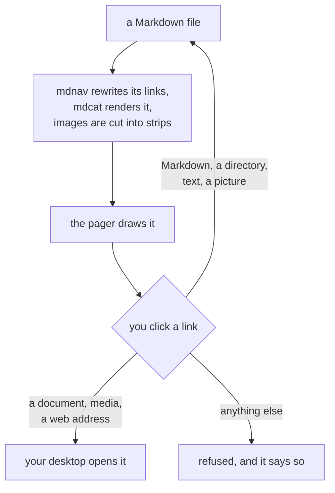
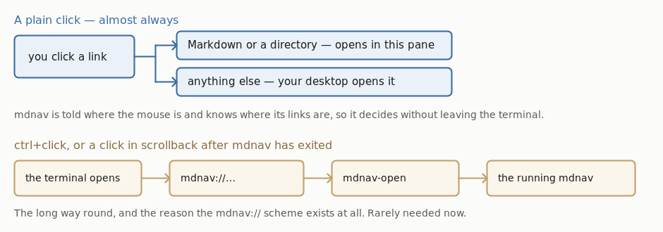

# mdnav

`mdcat`, with links you can click.

[mdcat](https://github.com/BIRSAx2/mdcat) renders Markdown in the terminal
beautifully, images included. What it cannot do is let you *follow* a link to
another local file: activating one hands it to your desktop, which opens it in
some other application, in some other window.

mdnav keeps you where you are. It is a pager — opens at the top of the
document, scrolls both ways, images and all — and a click on a link renders
what it points at in the same pane, with a back stack. Links to other files,
to a section of one, and to whole directories all work, so a documentation
tree can be read by walking it.

```
mdnav README.md
mdnav ~/notes            # a directory opens as its README, or as a listing
```

```
up/down, k/j           scroll a line
wheel                  scroll 3 lines (MDNAV_WHEEL_LINES)
space/PgDn, b/u/PgUp   scroll a page
g / G                  top / bottom
click                  follow a link; non-Markdown opens in your desktop app
/ ?                    search forward, backward
n / N                  next match, previous
esc                    clear the search
l                      list links with their targets, pick one by number
p, backspace           back to the previous file (:p too)
r                      reload now
Ng                     go to line N (as 50g)
:q, q                  quit
```

Resting the pointer on a link shows where it goes, in place of the usual
status line.

The bracketed hints on that line are buttons: clicking `[p back]`,
`[l list]` or `[q quit]` does what pressing the key does. `[p back]` only
appears, and only answers, when there is somewhere to go back to.

It re-renders on its own when the file changes on disk, so it can be left open
beside an editor; your place in the document is kept. `MDNAV_WATCH=0` turns
that off.

Long lines are left whole and wrapped by the terminal. mdcat wraps prose to the
width it is given but never code, since reflowing a code block would
misrepresent it, so code arrives wider than the window — and a line the
terminal wrapped is still one line to it, so selecting one copies it back
unbroken. Breaking them here instead would put real newlines into the middle
of the code. `-S` tells the terminal not to wrap, leaving long lines running
off the edge, as less's `-S` does.

`mdnav -c` renders once to stdout and exits, like mdcat. Links stay as plain
paths there, since nothing is running to receive a click. Piped rather than
shown on a terminal, mdcat cannot draw hyperlinks at all and numbers them
instead, listing the targets at the end — that list is longer here than under
mdcat alone because included files, HTML anchors and `{{#ref}}` directives all
become links that mdcat would otherwise not have seen. `-g` and `-G` control
search highlighting, as they do in less.

## Install

### First, mdcat

```
brew install mdcat          # macOS
pacman -S mdcat             # Arch
cargo install mdcat         # anywhere with a Rust toolchain
```

Prebuilt binaries are on [mdcat's releases
page](https://github.com/BIRSAx2/mdcat/releases). It is not packaged for Debian
or Ubuntu.

Building with `cargo` on Debian/Ubuntu needs the OpenSSL headers first,
otherwise the build fails partway through on `openssl-sys`:

```
sudo apt install pkg-config libssl-dev
```

### Then mdnav

```
git clone https://github.com/Ginger-Beard/mdnav
cd mdnav
./install.sh
```

## Try it

```
mdnav README.md
```

Then click these, which between them are everything a link can be:

- [another document](docs/developing.md) — opens in this pane, `p` comes back
- [the `lib` directory](lib) — no README in it, so you get a listing to walk
- [a source file](lib/mdnav_kind.py) — shown here, highlighted, with its own
  line numbers
- [a picture](docs/click-round-trip.png) — drawn here, and scrollable
- [the project on GitHub][repo] — a reference-style link, handed to a browser
- [Limitations](#limitations) — a place in this page

[repo]: https://github.com/Ginger-Beard/mdnav

If all six do what they say, everything works on your terminal. If one
does not, `MDNAV_DEBUG=/tmp/mdnav.log` will say why.

And this should be a diagram rather than a code block — it is drawn by
mdcat, sliced into strips, and scrolled through like anything else:



### What it needs

| | |
|---|---|
| `mdcat` | does the rendering; see above |
| `python3` | rewriting links, slicing images, searching. Standard library only |
| bash 3.2+ | so stock macOS bash is enough |
| `stty` | terminal size and raw input; from coreutils |
| ImageMagick (`convert`) | **strongly wanted**: without it images are not sliced, and a tall one jumps into view rather than scrolling. See [Images are sliced](#images-are-sliced) |
| `xdg-open` (Linux), `open` (macOS) | only for links to files that are not Markdown, which are handed to the desktop |
| `wslview` (WSL, optional) | from [wslu](https://github.com/wslutilities/wslu). Not needed -- see [Opening things on WSL](#opening-things-on-wsl) |

Most of that is already on a working system; `python3` and `stty` effectively
always are. ImageMagick usually is not:

```
sudo apt install imagemagick          # Debian, Ubuntu, WSL
sudo pacman -S imagemagick            # Arch
sudo dnf install ImageMagick          # Fedora
brew install imagemagick              # macOS
```

#### Mermaid diagrams

Mermaid asks for its labels in lower case (`"trebuchet ms", verdana,
arial, sans-serif`), and the renderer that draws these diagrams matches a
font family case-sensitively, so nothing matches and the labels are drawn
as nothing at all -- boxes and arrows, no text, no error. Installing the
fonts it names does not help: the names were never missing, only spelled
in the wrong case.

So mdnav names a font itself, in the copy it renders rather than in your
file, asking the system which family its `sans-serif` actually is so the
capitals are right. A diagram that already names its own font is left
alone. `MDNAV_MERMAID_FONT` picks a different one, and setting it empty
turns this off.

#### Opening things on WSL

A link to something that is not Markdown -- a PDF, a spreadsheet, a web
address -- is handed to whatever opens such things. Under WSL that is
Windows, and `xdg-open` does not know it: a distribution installed to be
used from a terminal has no desktop, and so no idea what opens a PDF.
Nothing happens, and nothing says why.

So mdnav crosses over itself, converting the path with `wslpath` and
handing it to `explorer.exe`. That needs nothing installed.

`wslview`, from [wslu](https://github.com/wslutilities/wslu)
(`sudo apt install wslu`), is used in preference when it is there. What it
adds is small and mostly not about mdnav:

- it launches through PowerShell's `Start-Process` rather than
  `explorer.exe`, which reports failure even when it worked;
- it registers itself as the system handler for `http`, `https` and
  `file`, so *other* terminal programs open things in Windows too;
- it says so plainly when WSL interoperability is switched off.

What it does not fix is Office refusing to open a document stored inside
the WSL filesystem. Windows sees those as a network location
(`\\wsl$\...`), and Protected View blocks them -- which looks like a
prompt appearing and nothing happening after it. `wslview` builds the same
kind of path, so it behaves the same. Either trust that location in
Word's Trust Center, or keep such files under `/mnt/c`, where they get a
real `C:` path and open without argument.

Registering the `mdnav://` scheme uses whatever the platform provides, and only
during `install.sh`: `reg.exe` and `wscript` on WSL, `xdg-mime` and
`update-desktop-database` on Linux, `osacompile` and Launch Services on macOS.
All ship with their systems.

`install.sh` symlinks `mdnav` into `~/.local/bin` and registers the `mdnav://`
scheme with your desktop. `./uninstall.sh` removes both, including the registry
keys on WSL and the strip cache.

### Locked-down machines

Clicking needs the `mdnav://` scheme registered, and on Windows the registry is
the only mechanism for that. The keys go under `HKEY_CURRENT_USER`, so no admin
rights are involved and it usually works on managed laptops — but some are
locked down further.

If the write fails, `install.sh` says so and leaves everything else working. It
also writes `mdnav-install.reg` and `mdnav-uninstall.reg` into
`%LOCALAPPDATA%\mdnav\`, so you can review the change, apply it by
double-clicking, or hand it to whoever administers the machine. It adds nothing
outside `HKEY_CURRENT_USER\Software\Classes\mdnav`.

To skip registration entirely:

```
./install.sh --no-scheme
```

mdnav still works — you follow links with `l` and a number rather than by
clicking. Nothing needs installing at all for that; `./bin/mdnav` runs as-is.

## What a link can point at

- **Another Markdown file**, which opens in the same pane. `p` goes back.
- **A place in this document** (`[see](#section)`), which scrolls there and
  marks the heading it landed on until you scroll, since near the end of a
  file the view cannot put it at the top. A numbered citation
  (`[[21]](#references)`, which is how Markdown documents cite, having no
  anchor per item) lands on item 21 rather than on the heading, falling
  back to the heading if there is no such item. Anchors are matched to
  headings the way GitHub and mdBook spell them.
- **A place in another document** (`[see](other.md#section)`), which opens
  that file and lands on the section. If the file exists but the section
  does not, it opens at the top.
- **A directory**, which opens the page inside it -- `README.md` or
  `index.md` -- the way every documentation tree reads one: `docs/setup/`
  is the setup section and its README is the front page. A directory with
  no such page is written out as one: a listing of what it holds, each
  entry a link, so a tree can be walked down into and `p` walks back out.
  A directory works as an argument too: `mdnav ~/notes`.
- **A file that is text** -- source code, a config file, a log, a
  `Dockerfile` -- which is shown here, highlighted, with the file's own
  line numbers down the side. `MDNAV_LINE_NUMBERS=0` leaves them off, which
  is what to do when the point is to copy the text back out.
- **A picture**, which is drawn here, scrolled in strips like any other
  image. Where the terminal cannot draw at all it goes out to whatever
  shows pictures, since a picture nobody can see is no use.
- **A document or a media file** -- a PDF, a spreadsheet, a video -- which
  is handed to whatever opens such things on your system. So is a web
  address, and so is an SVG, being a picture nothing here can draw.
- **Anything else is refused**, and the bar says so.

That last one is deliberate. Opening a file and running it are the same
gesture on every desktop: `explorer.exe` starts a `.exe` or a `.bat`,
`open` launches a `.app` or runs a `.command`, and `xdg-open` will do
whatever the desktop has been told to for a `.desktop` file or a script.
A link in a document you did not write is not a thing to hand over
blindly.

So nothing is handed over on the strength of its name. What a file is, is
read from what is in it: a picture by the bytes every picture starts with,
text by reading it. Only pictures, documents and media are passed on;
anything that reads as text is shown here, where it can do nothing; and
what is left over -- a program, an installer, an archive, a macOS bundle
-- is refused. A program renamed `report.pdf` is still refused, and a
picture with no extension at all still opens.

A local link that resolves to nothing is shown as plain text rather than as
a link, since a link that cannot go anywhere is worse than none. Run with
`MDNAV_DEBUG` set to be told which, and why.

Links written for a site's built output are followed to the source they came
from: `dir/index.html` to that directory's `README.md`, `foo.html` to
`foo.md`. Reference-style links (`[a][b]`) are resolved against their
definition. Links inside code -- a fence, an indented block, a code span --
are left alone, because the document is showing you the markup rather than
offering it.

Raw HTML is tidied, since Markdown permits it and a terminal renderer prints
it verbatim: `` becomes a Markdown image and is drawn, `<a href>` a
followable link, and tags like `<details>` and `<span>` are dropped while
their text is kept. An `` with an empty `alt` is dropped rather than
drawn, that being how a document says an image is decoration -- badges
either side of a link, usually, which drawn would bury the link between
them. Code blocks are left exactly as written; `MDNAV_HTML=raw` turns all
of this off.

mdBook directives are handled, since raw sources are read without the
preprocessor that would expand them: `{{#ref}} path {{#endref}}` is followed
as a link, and `{{#include path}}` is inlined, line ranges included. A
missing include is left visible rather than dropped, and an included file's
own relative links keep pointing where they meant to.

## Limitations

- A bare `[name]` with its definition elsewhere is not followed. It cannot
  be told from ordinary brackets, and `[[21]]` is a citation rather than a
  target.
- A link in a table cell whose text the table had to wrap across two lines
  is left plain. It is still reachable from `l`.
- `-c` renders through mdcat directly, so table-cell links are not restored
  there. See [Upstream](#upstream).
- A tall image scrolls rather than fitting: slicing scales an image to the
  window width but not its height.
- Only WSL2 has actually been tested. See
  [Platform support](#platform-support).

## Platform support

Two setups are in real use. The rest is written from the specs and reasoning
here and has never been run. Reports very welcome.

| | clicking | images | tested |
|---|---|---|---|
| WSL2 + Windows Terminal | yes | yes, sixel | **yes** |
| macOS + Ghostty | yes | not yet tried | **yes**, in daily use |
| Linux, OSC 8 terminal (kitty, WezTerm, foot…) | should work, via XDG | should work | no |
| Terminal without OSC 8 | no — use `l` to pick links by number | unchanged | no |

Images are only cut into strips for **sixel**. A terminal drawing them by
the kitty protocol — Ghostty, kitty itself — gets whole images, which show
correctly but jump into view rather than scrolling, as they do anywhere
without ImageMagick.

On **Linux** the scheme is claimed with an XDG `.desktop` entry; on **macOS** by
building a small AppleScript app bundle in `~/Applications` and handing it to
Launch Services. Both follow the documented mechanism, neither has been
exercised.

macOS ships bash 3.2, which mdnav works around, so no Homebrew bash is needed.

**On WSL**, the `mdnav://` scheme is registered under `HKCU` and dispatched
back through `wsl.exe`. Windows Terminal shows a *"This link may lead to an
unsafe location"* confirmation before opening any non-web scheme, and offers
no setting to suppress it — but that only applies to the long way round.
A plain click is answered by mdnav without the terminal being involved, so
no dialog appears, whether the link opens here or in a Windows application.

## Environment

| | |
|---|---|
| `MDCAT_BIN` | mdcat to run, if not the one on `PATH` |
| `MDNAV_IMAGE_PROTOCOL` | force `sixel`, `kitty`, `iterm2`, or `none` |
| `MDNAV_SLICE` | `0` to leave images whole rather than cutting them into strips |
| `MDNAV_MERMAID_FONT` | font for Mermaid labels; empty to leave the diagram's own |
| `MDNAV_LINE_NUMBERS` | `0` to show a file without its line numbers |
| `MDNAV_FIFO` | where the click handler and the reader meet |
| `MDNAV_INSTANCE` | this instance's name in the links it renders |
| `MDNAV_SCHEME` | URL scheme, if `mdnav` collides with something |
| `MDNAV_HTML` | `raw` to leave HTML in the source alone |
| `MDNAV_WATCH` | `0` to stop re-rendering when the file changes |
| `MDNAV_WHEEL_LINES` | lines per wheel notch (default 3); `-1` for a screen |
| `MDNAV_MOUSE` | `0` to leave the wheel to the terminal |
| `MDNAV_KEY_POLL` | key poll interval, in seconds |
| `MDNAV_DEBUG` | write a trace to this file: every link dropped and why, whether images were left whole, and whether a document was rendered or reused |

mdcat's own image detection reports `ansi` on Windows Terminal even where sixel
works, and then renders without images, silently. mdnav probes for itself and
passes the answer explicitly; `install.sh` offers to set
`MDCAT_IMAGE_PROTOCOL=sixel` in your shell rc so plain `mdcat` behaves too.

### Search

`/` and `?` search forward and backward, `n` and `N` repeat, `esc` clears.
At the prompt, backspace rubs out, and rubbing out the last character
abandons the search, as does escape; ctrl-u clears it and ctrl-w takes back a
word. A bare `/` repeats the previous pattern.
Patterns are regular expressions, and a pattern typed in lower case matches
either case -- the same bargain less strikes.

Every match is marked in reverse video, as in less, and the one you are on is
underlined as well, so it can be told from its neighbours. `-g` marks only the
current match and leaves the rest unmarked, as less does; `-G` marks none. The
status line counts your place either way, as `[2/7]`.

Matches are counted by occurrence rather than by line, so a line containing the
pattern twice is two stops for `n`, and `-g` marks the instance you are on
rather than both.

Matching happens against what is on screen as text, not the bytes making it
up, so colour escapes, hyperlinks and images do not get in the way of a
pattern; the highlight is then inserted around the match without disturbing
the line's own styling. A search survives following a link, and is re-run
against the new document.

### The wheel

One notch moves three lines, which is what toolkits and terminals
overwhelmingly use. Windows records a preference for this and X11 and macOS do
not, so honouring it would have meant a platform-specific lookup on every
launch for a value that is almost always three. `MDNAV_WHEEL_LINES` overrides
it; `-1` means a screen at a time.

While mdnav holds the mouse, the terminal stops using it for selection:
**shift+drag** to select text, which terminals honour as the way past an
application that has taken the mouse. `MDNAV_MOUSE=0` hands it back
altogether, at the cost of the wheel moving a line at a time.

Reading wheel events at all means turning on mouse reporting. Alternate scroll
(`\e[?1007h`) would avoid that by having the terminal send arrow keys instead,
but Windows Terminal sends exactly one arrow per notch whatever the setting
says, so the preference is lost on the way through. Terminals still handle
ctrl+click on hyperlinks while reporting is on; `MDNAV_MOUSE=0` falls back to
alternate scroll for any that do not.

## How it works

### Clicking



Almost every click is answered by mdnav itself. It is told where the mouse
is and knows where each of its links sits, so it decides what to do without
asking anyone: Markdown and directories open in the same pane, and anything
else — a PDF, a spreadsheet, an image, a web page — is handed straight to
whatever opens such things on your system. That is a plain click, and it is
all you need day to day.

The rest of this section is about the long way round, which you are unlikely
to meet.

A terminal has no way to tell a *running program* that you clicked something.
So for the cases where mdnav is not the one being asked — ctrl+click, or a
click on a link still sitting in scrollback after mdnav has exited — it
borrows the one channel that does cross that gap: a URL scheme.

1. Before rendering, mdnav rewrites local links in a temp copy of the document
   from `./OTHER.md` to `mdnav://<instance>/abs/path/OTHER.md`.
2. mdcat renders that copy and emits each link as an OSC 8 hyperlink — the
   terminal owns the hit-testing from there.
3. Activating one hands `mdnav://…` to the desktop, which routes it to
   `mdnav-open`.
4. `mdnav-open` writes the path into a FIFO the running mdnav is reading, and
   mdnav renders it in place.

Each instance has its own FIFO and names itself in the links it renders --
`mdnav://<instance>/<path>` -- so with several open at once, a click goes back
to the window it was clicked in rather than to whichever started last.

If that instance has since quit, any other live mdnav takes it; if none is
running, `mdnav-open` opens the file the ordinary way. A click never silently
does nothing.

### Images are sliced

Being a pager at all depends on this. A sixel image is a single escape sequence
the terminal rasterises whole, routinely tens of rows tall, and nothing above
the terminal can say how tall it came out or draw part of it. A pager cannot
lay out what it cannot measure — which is also why piping mdcat to `less`
fails: less counts a 79-row image as one line and draws the rest over the text.

So mdnav cuts each image into strips exactly one text row tall, one sixel
escape each. It does this to mdcat's *output* rather than its input, which
also catches Mermaid diagrams and rendered maths -- mdcat draws those as
images although nothing in the Markdown says so. Every line in the buffer is then exactly one
screen row: layout is arithmetic again, and a half-scrolled image is simply the
strips that fall inside the window.

This needs ImageMagick (`convert`) and a sixel terminal. Without either, images
are left whole for mdcat to draw — everything still works, but a tall image
jumps into view rather than scrolling.

A picture wider than the window is narrowed to it on the way past. The
renderer cannot do that: writing to a file, it has no way to ask the
terminal how many pixels a column is, so it draws at the picture's own size
and a wide diagram runs off the right. mdnav has asked, so it can.

Strips are cached under `~/.cache/mdnav`, keyed by the image's own content,
the height of a terminal cell and the width it was narrowed to -- so an
edited image, or a resized window, gets a different key rather than a stale
answer. Slicing a diagram takes about a sixth of a second
the first time and a fraction of that afterwards. The cache is safe to delete;
it refills itself.

Every movement repaints rather than scrolling the terminal's scrolling region.
The region would be cheaper, but terminals move the text cells and leave the
sixel pixels behind, which tears images into stripes. A repaint of a screenful
of strips measures around 15ms.

## Related

**mdcat symlinked as `mdless`.** mdcat paginates through `less` when invoked
under that name. It is the same arrangement as `mdcat -p`, and it inherits
less's difficulty with images: a sixel image is one line as far as less is
concerned, however many rows it occupies, so the text after it is drawn over.
There is no link following either. Slicing images into one-row strips is what
mdnav does about the first of those, and the URL scheme about the second.

**[ttscoff/mdless](https://github.com/ttscoff/mdless)** is an unrelated Ruby
markdown pager of the same name, packaged in Homebrew. It renders and
paginates, but does not draw images or follow links. Mentioned also because
the name is taken twice over, which is why this is not called mdless.

## Why not just…

Things that look like they should work, and don't:

- **mdcat's own links.** mdcat renders local links as `file://<hostname>/path`
  — correct per the OSC 8 spec, so links resolve over SSH. Windows cannot open
  that form, so on WSL every link fails with *"This link type is currently not
  supported."* A custom scheme passes through mdcat untouched; `file://` does
  not.
- **Registering mdcat as the `.md` handler.** Works, but every click opens a new
  window — the thing you were trying to avoid.
- **Piping to `less`.** `less -R` prints raw sixel as text, and `-r` passes it
  through but miscounts line widths, so a kilobyte-long image line wraps across
  a dozen rows. Sliced strips would fix the row counting, but not the width
  arithmetic.
- **Mouse tracking (`\e[?1000h`) for the wheel.** It works, and the terminal
  still activates hyperlinks on ctrl+click while it is on. But scrollback
  belongs to the terminal and cannot be driven from an application, so taking
  the plain wheel means it only scrolls one way. Alternate scroll (`\e[?1007h`)
  gets the wheel as arrow keys instead, and costs nothing.
- **Printing everything and scrolling back to the top.** There is no way to move
  the viewport: `CSI T` inserts blank lines and discards the bottom of the
  buffer rather than restoring anything from scrollback.

## Upstream

Four things mdnav has run into in what it builds on. Two of them it works
around, and will stop working around by itself once they are fixed,
because each workaround only acts when the problem is actually present.

| Where | What | Status |
|---|---|---|
| [mdcat#39](https://github.com/BIRSAx2/mdcat/pull/39) | A quoted list loses the `│` on its lines after the first | fix open |
| [mdcat#40](https://github.com/BIRSAx2/mdcat/pull/40) | A quoted code block loses the `│` on its lines | fix open |
| mdcat | A link in a table cell keeps its style and loses its destination, so it is drawn as a link and is not one | fix written; worked around meanwhile |
| [merman#113](https://github.com/Latias94/merman/issues/113) | Mermaid labels are not drawn at all: the font family is matched case-sensitively, and Mermaid asks for its own in lower case | reported; worked around |

**Links in table cells.** mdnav knows the destination -- it wrote it -- so
after rendering it compares what it asked for against what came out and
puts back the difference, in the table the link was written in and only
where the text is found. A link the renderer did emit is never touched, so
a version that carries them itself leaves this with nothing to do.

**Mermaid labels.** mdnav names a font in the copy it renders, asking the
system what its `sans-serif` actually is so the capitals are right. A
diagram that names its own font is left alone. Installing the fonts
Mermaid asks for does not help, because the names were never missing --
only spelled in a case that does not match. See
[Mermaid diagrams](#mermaid-diagrams) and
[merman#113](https://github.com/Latias94/merman/issues/113).

## Working on it

[docs/developing.md](docs/developing.md) — what is where, how to run the
tests, how to drive the pager by hand, and what the trace can tell you.

## Licence

MIT — see [LICENSE](LICENSE).

mdnav runs [mdcat](https://github.com/BIRSAx2/mdcat) (MPL-2.0) and ImageMagick as
separate programs and includes no code from either.
